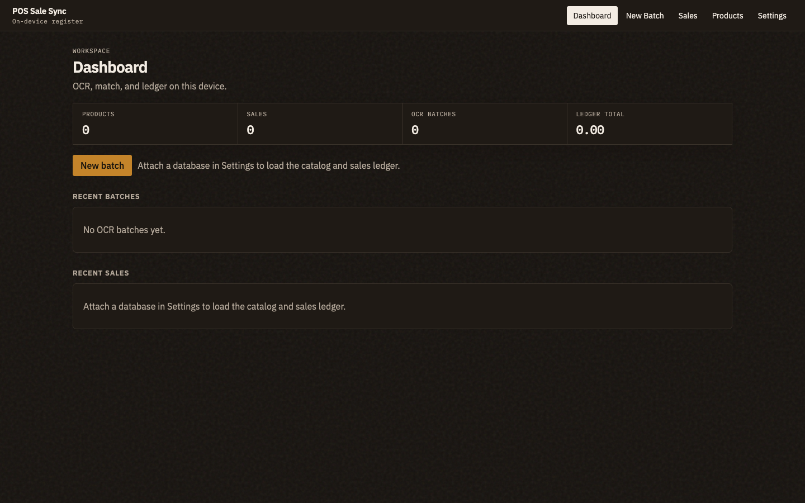

# POS Sale Sync

### Screenshots in. Matched sales out. On your device.

A focused workspace for reading card-terminal transaction history and writing matching sales into an Aronium `pos.db`. OCR, product matching, and SQLite writes stay in the browser. Nothing is uploaded.

[](https://aneebji.github.io/aronium-db-editor/)
[](./LICENSE)
[](#privacy)
[](./package.json)

[**Launch the app →**](https://aneebji.github.io/aronium-db-editor/) · [Report a bug](https://github.com/aneebji/aronium-db-editor/issues)



## What it does

| Capability | Detail |
| --- | --- |
| **Extract** | Reads DateTime and amount from terminal history screenshots with Tesseract.js plus a dedicated date/amount parser. |
| **Match** | Picks one enabled product: exact price first, otherwise a nearby random price. Sale total stays the card amount. |
| **Enter sale** | Writes Aronium-compatible rows (`Document`, `DocumentItem`, `DocumentItemTax`, `Payment`, `Stock`, `Counter`). Schema is not changed. Each sale DateTime is written with a random extra 7 to 15 seconds. |
| **Duplicates** | The same original OCR second is marked **Already added**. A one-second difference on the slip is a new sale. |
| **Ledger** | After you attach `pos.db`, Dashboard, Sales, and Products load the live catalog and existing sales. OCR inserts show a batch number in the Source column; other tickets are marked Original. |

## From screenshot to sale

1. **Settings** — Choose your Aronium `pos.db` once. Set the default year for slips that omit it.
2. **New Batch** — Drop one or more PNG/JPG screenshots.
3. **Extract** — Review DateTime and Price. Edit or skip a row if needed.
4. **Match** — Fill product code and name. **Rematch random** draws another eligible product.
5. **Enter Sale** — The original and updated databases download together as a zip. Chrome or Edge can also overwrite `pos.db` in place.

Close Aronium before writing. VAT is treated as 15% inclusive. Payment type is Debit Card. Sale numbers use `{yy}-200-{seq}`.

## Privacy

Images and `pos.db` never leave this device. The hosted page only loads the app assets. History is stored in `localStorage` on the machine that ran the batch. This repository does not include a live store database or real terminal photos.

Bring your own `pos.db` and your own screenshots.

## Browser support

| | Chrome / Edge | Safari / Firefox |
| --- | --- | --- |
| **OCR and match** | Yes | Yes |
| **Write `pos.db` in place** | File System Access API | Use the updated file from the zip |
| **Backup** | Zip with `original-pos.db` and `updated-pos.db` | Same |

## Develop locally

Use Node.js 20+ and npm.

```bash
git clone https://github.com/aneebji/aronium-db-editor.git
cd aronium-db-editor
npm ci
npm run dev
```

| Command | Purpose |
| --- | --- |
| `npm run dev` | Vite development server |
| `npm run build` | Production build into `dist/` |
| `npm run build:pages` | GitHub Pages build into `docs/` with base `/aronium-db-editor/` |
| `npm run preview` | Preview the production build |

### Publish to GitHub Pages

GitHub Pages should serve the `main` branch from `/docs`.

```bash
npm run build:pages
```

Commit the source and generated `docs/` output, then push. The live URL is **https://aneebji.github.io/aronium-db-editor/** once Pages is enabled.

## Limits

- Browser OCR is weaker than native desktop engines. The parser is what keeps multi-line slips complete.
- File System Access requires a Chromium browser and an explicit file permission.
- This is not a hosted POS, cloud sync, or account service.

## License

[MIT](./LICENSE) © 2026 Aneeb.
